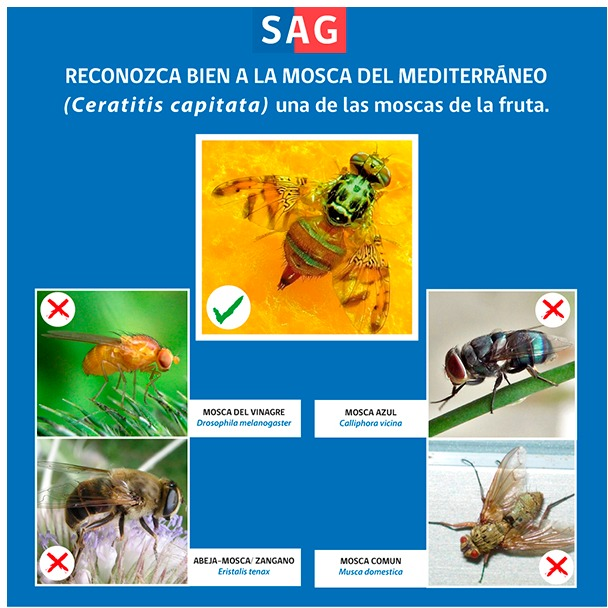
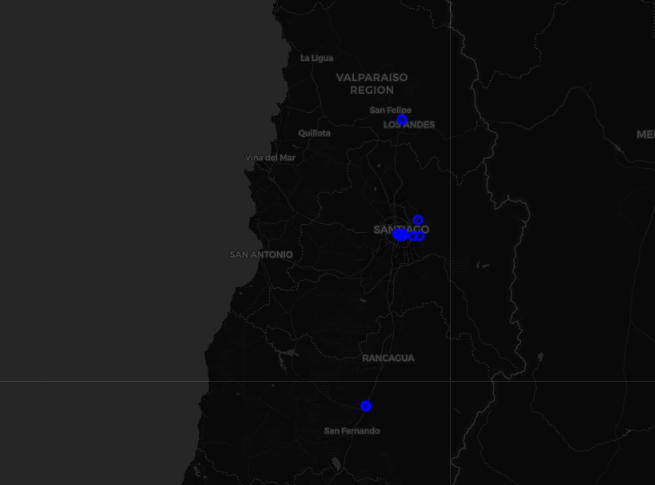

# SAG_Chile_Fruity-Fly : MEDITERRANEAN FRUIT FLY Mosca de la Fruta (Ceratitis capitata  (Wied) )

  
  

SAG Chile Visualización de densidad poblacional de plaga - MEDITERRANEAN FRUIT FLY Mosca de la Fruta (Ceratitis capitata  (Wied) )

  

Etapa 1:
https://github.com/FranciscoReyne/SAG_Chile_Fruity-Fly/blob/main/SAG_Mediterranean_Fruit_Fly%20(3).ipynb
