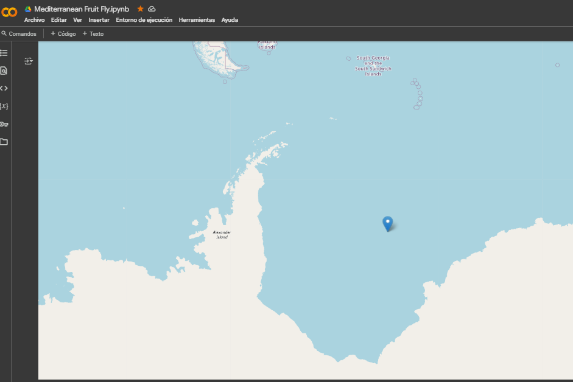
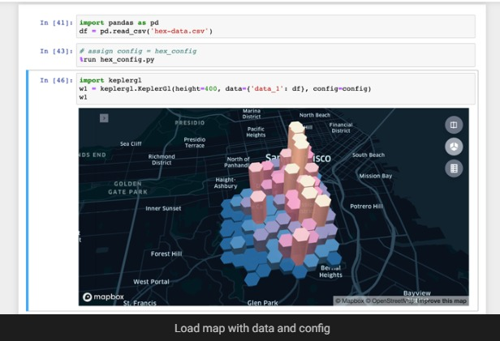

# SAG_Chile_Fruity-Fly : MEDITERRANEAN FRUIT FLY Mosca de la Fruta (Ceratitis capitata  (Wied) )

  
  

  

SAG Chile Visualización de densidad poblacional de plaga - MEDITERRANEAN FRUIT FLY Mosca de la Fruta (Ceratitis capitata  (Wied) )

  

